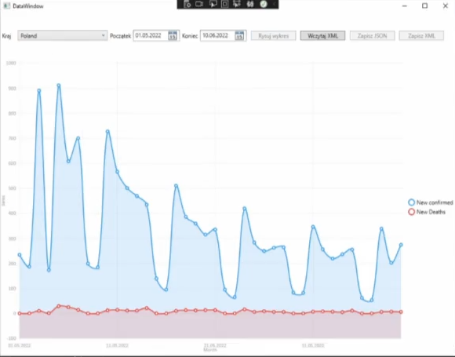
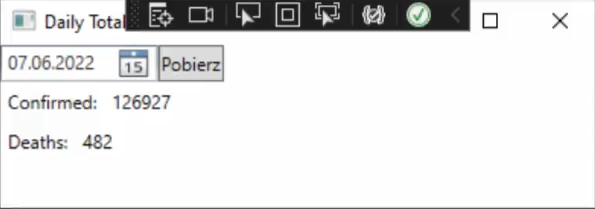

# COVID Data Integration Project

## Overview

This is a client-server application designed to display COVID-19 case and death statistics on a graph for a specified country and date range. The application allows exporting the graph data to either XML or JSON format. Data can be retrieved from an external API or imported from an XML file. Retrieved data is stored in a database. Additionally, the project includes a SOAP service for providing the number of deaths and confirmed cases for a specified date. All components of the application are containerized using Docker with all necessary dependencies.

## Technologies

Two server applications and two client applications were created. The server application, which integrates data, was written in C# (ASP.NET Core Web Application). The client application is a WPF (Windows Presentation Foundation) desktop application for the .NET platform. The following functionalities were implemented:
- Handling REST API service for data retrieval
- Importing data in XML format
- Exporting data in XML and JSON formats
- Serialization and deserialization of data in JSON format (using Newtonsoft JSON)
- Saving retrieved data to a SQL database and reading data from the SQL database using Entity Framework Core
- Implementation of authentication and authorization mechanisms (support for token-based JWT authorization)
- Use of graphical layer: user interface, data retrieval, result display, etc. (LiveCharts WPF)

The SOAP server application implements web services using SOAP technology. It was implemented in Java and built using Maven. The client application is a WPF (Windows Presentation Foundation) desktop application for the .NET platform. The following functionalities were implemented:
- Handling SOAP service for data retrieval by the client application
- Reading data from the database using the Hibernate framework (using MySQL Connector/J, which enables connection between the application and MySQL database from Java)
- Implementation of transaction mechanisms for database access (read and write)
- Use of graphical layer - displaying results (WPF)

## Screenshots

Here are some screenshots of the application:

*Graph View - COVID-19 Statistics*

*SOAP Client Interface*

## Installation

To run the project, you need to open a command prompt and navigate to the main project directory (`Projekt`). Then, issue the command `docker-compose up`. After successfully starting the containers, you can proceed to the applications located in the `Client` and `SoapClient` directories. The easiest way to run them is from within the MS Visual Studio project. Alternatively, you can find the `Client.exe` and `SoapClient.exe` files in the `~\bin\Debug\` folders.